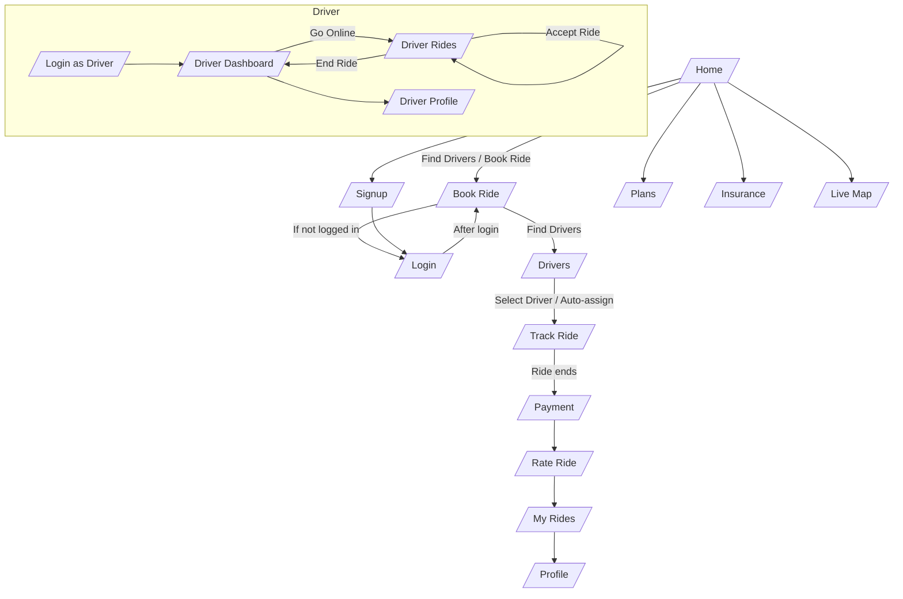

# DriveEase User & Driver Flow

---

- Paste this diagram in your README.md or any Markdown file to view it in VS Code with the Mermaid extension, or use an online Mermaid live editor.
- This flow matches your current app navigation and logic.
